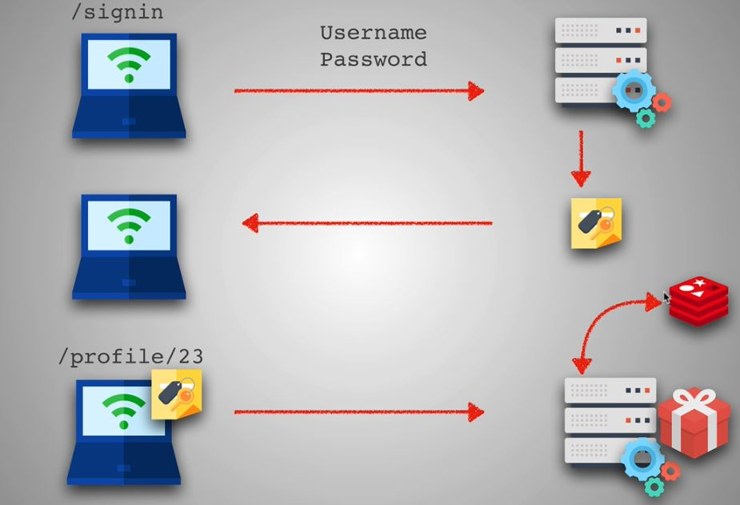

#                                          JWT + Sessions

  
   

  
   

## JWT

in cookies in your browser there is your infos

JSON Web Tokens are an open, industry standard [RFC 7519](https://tools.ietf.org/html/rfc7519) method for representing claims securely between two parties.

