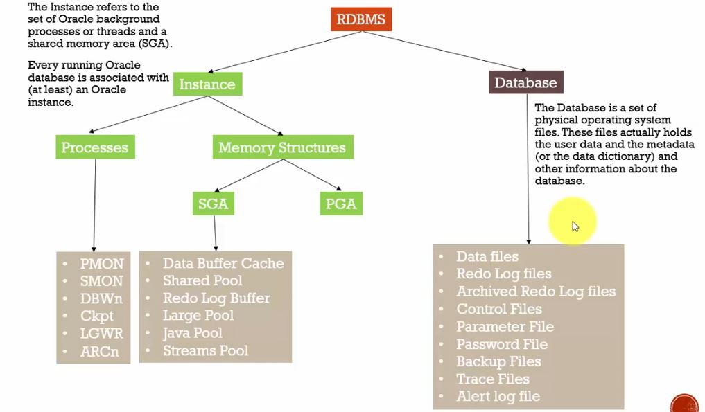

#     ORACLE DBA 

## 01 - OLTP VS OLAP

OLTP: Online transaction processing

OLAP: Online Analytical Processing

  
   

## 2 - Grid Computing

a way to organize machines in such a way that they can be flexible and accessed

- Processors

- Storage

- DB

- Apps

  

  
   

  

  ## 3 - Cloud Computing

  

  ## 4 - UNDO & Redo

  Undo is reverse action of an earlier action

  Redo is do something again

  ## 5 - RDBMS Archetecture

  

  
   

  

The database should be associated with at least one instance

 use a lot of instances: support a huge number of users