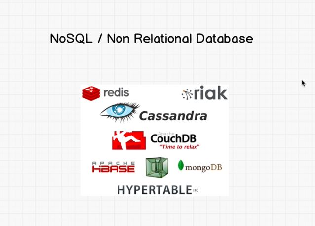

#                                                  REDIS

## 1-Relational db and noSQL db

<p align="center">
  
  <br/>
</p>

SQL assure the communication between backend and RDB.

it use for relational data(Tables)

<p align="center">
  
  <br/>
</p>

it is for non relational data and huge data =>  LinkedIn

it is very fast because it based on nodes.

<p align="center">
  
  <br/>
</p>

## 2-Redis commands

<p align="center">
  
  <br/>
</p>

**EXPIRE** **:** you give him time on sec before the data been deleted

```bash
MSET a 2 b 5 #a=2 b=5

```

there is 5 Main Data types on Redis:

- Strings
- Hashes
- Lists
- sets
- Sorted sets

## Hashes

it looks like objects

```bash
HMSET user id 45 name "jonny"
HGET user id #"45"
```

## Lists

linked Lists

```bash
LPUSH ourList 10 #push from the left
RPUSH ourlist 20
LRANGE ourlist 0 1 #get list from start=0 to end=1
LTRIM ??
RPOP ourList
```

## Sets/ OrdredSets

unordered collection of strings and it not allowing repeated values or members.

```bash
SADD ourSet 1 2 3 4 5
SMEMBERS ourSet
SADD ourSet 1 2 3 4 #it will not add it cauz it exists
SMEMBER ourSet 20 #it return 0 that means it is not member of the st
```

every elements of the set is associate to a score and that allows to be ordred

```bash
#the score here is the player number
ZADD team 50 "Wizards" #team with 50 player 
ZADD team 40 "Cavaliers"
ZRANGE team 0 1 #cav first then wizards will appeare
ZRANK team "Wizards" #1
```

